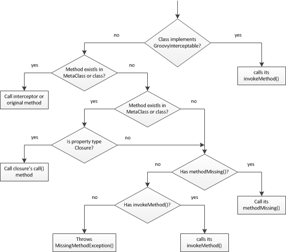

运行时&编译时元编程
=====================

Groovy 提供两类元编程，分别为:运行时元编程与编译时元编程。第一种允许在运行时改变类模型，而第二种发生在编译时。其各有优劣之处，这一章节我们详细讲解。

运行时元编程
-------------------------

在运行时元编程中，我们在运行时拦截，注入甚至合成类和接口的方法。为了深入理解 Groovy MOP ， 我们需要理解 Groovy 的对象及方法的处理方式。Groovy 中有三类对象：POJO，POGO 和 Groovy 拦截器。Groovy 中对于以上对象均能使用元编程，但使用方式会有差别。

- ``POJO`` - 正规的 Java 对象，其类可以用Java或任何其他 JVM 语言编写。
- ``POGO`` - Groovy 对象，其类使用 Groovy 编写。继承于 ``java.lang.Object`` 并且实现 `groovy.lang.GroovyObject <http://docs.groovy-lang.org/2.4.5/html/gapi/index.html?groovy/lang/GroovyObject.html>`_ 接口。
- ``Groovy Interceptor`` - Groovy 对象，实现 ``groovy.lang.GroovyInterceptable`` 接口，具有方法拦截能力，我们将在 ``GroovyInterceptable`` 章节详细讲解。

For every method call Groovy checks whether the object is a POJO or a POGO. For POJOs, Groovy fetches it’s MetaClass from the groovy.lang.MetaClassRegistry and delegates method invocation to it. For POGOs, Groovy takes more steps, as illustrated in the following figure:

每个方法调用过程中， Groovy 检查当前对象是 POJO 还是 POGO。对于 POJOs ， Groovy 将从 ``groovy.lang.MetaClassRegistry`` 中取出其 ``MetaClass`` 并使用代理方式进行方法调用。对于 POGOs，Groovy 将执行更多步骤，如下图

GroovyObject interface
^^^^^^^^^^^^^^^^^^^^^^

``groovy.lang.GroovyObject`` 作为 Groovy 中的主要接口，就像 Java 中的 ``Object`` 类。
``GroovyObject``  的在 ``groovy.lang.GroovyObjectSupport`` 中默认实现,  其主要负责将调用传递给 ``MetaClass`` 对象。
参考下面代码：
 
 .. code-block:: groovy
 
    package groovy.lang;

    public interface GroovyObject {

        Object invokeMethod(String name, Object args);

        Object getProperty(String propertyName);

        void setProperty(String propertyName, Object newValue);

        MetaClass getMetaClass();

        void setMetaClass(MetaClass metaClass);
    }

invokeMethod
"""""""""""""""""""""""

在运行时元编程模式下，当 Groovy 对象上调用的方法不存在时，将会调用  ``invokeMethod`` 方法。
下面的例子中，就是用到重载 ``invokeMethod`` 方法：

.. code-block:: groovy

    class SomeGroovyClass {

        def invokeMethod(String name, Object args) {
            return "called invokeMethod $name $args"
        }

        def test() {
            return 'method exists'
        }
    }

    def someGroovyClass = new SomeGroovyClass()

    assert someGroovyClass.test() == 'method exists'
    assert someGroovyClass.someMethod() == 'called invokeMethod someMethod []'

get/getProperty
""""""""""""""""""""""""

对象上读取属性操作都将通过重载 getProperty 方法拦截，例如：

.. code-block:: groovy

    class SomeGroovyClass {

        def property1 = 'ha'
        def field2 = 'ho'
        def field4 = 'hu'

        def getField1() {
            return 'getHa'
        }

        def getProperty(String name) {
            if (name != 'field3')
                return metaClass.getProperty(this, name)                    // <1>
            else
                return 'field3'
        }
    }

    def someGroovyClass = new SomeGroovyClass()

    assert someGroovyClass.field1 == 'getHa'
    assert someGroovyClass.field2 == 'ho'
    assert someGroovyClass.field3 == 'field3'
    assert someGroovyClass.field4 == 'hu'
    
<1> Forwards the request to the getter for all properties except field3.

通过重载 setProperty  方法可以拦截属性修改操作：

.. code-block:: groovy

    class POGO {

        String property

        void setProperty(String name, Object value) {
            this.@"$name" = 'overriden'
        }
    }

    def pogo = new POGO()
    pogo.property = 'a'

    assert pogo.property == 'overriden'

get/setMetaClass
""""""""""""""""""""""""""""

You can a access a objects metaClass or set your own MetaClass implementation for changing the default interception mechanism. For example you can write your own implementation of the MetaClass interface and assign to it to objects and accordingly change the interception mechanism:

通过访问对象的 metaClass 或 重新设置你自己的 MetaClass 实现，可以改变默认的拦截机制。
下面例子中，你可以通过自己实现一个 MetaClass 并赋值给其对象上，这样就可以改变拦截机制：

.. code-block:: groovy

    // getMetaclass
    someObject.metaClass

    // setMetaClass
    someObject.metaClass = new OwnMetaClassImplementation()

在 ``GroovyInterceptable`` 章节中有更多实例用于参考。

get/setAttribute
^^^^^^^^^^^^^^^^

This functionality is related to the MetaClass implementation. In the default implementation you can access fields without invoking their getters and setters. The examples below demonstrate this approach:

这一功能与 MetaClass 的具体实现有关。在默认的实现中，你可以无需调用 fields 上的 getters  和 setters 方法，就可以通过 ``get/setAttribute`` 访问控制 fields 。
下面例子中将展示这种特性：

.. code-block:: groovy

    class SomeGroovyClass {

        def field1 = 'ha'
        def field2 = 'ho'

        def getField1() {
            return 'getHa'
        }
    }

    def someGroovyClass = new SomeGroovyClass()

    assert someGroovyClass.metaClass.getAttribute(someGroovyClass, 'field1') == 'ha'
    assert someGroovyClass.metaClass.getAttribute(someGroovyClass, 'field2') == 'ho'

.. code-block:: groovy

    class POGO {

        private String field
        String property1

        void setProperty1(String property1) {
            this.property1 = "setProperty1"
        }
    }

    def pogo = new POGO()
    pogo.metaClass.setAttribute(pogo, 'field', 'ha')
    pogo.metaClass.setAttribute(pogo, 'property1', 'ho')

    assert pogo.field == 'ha'
    assert pogo.property1 == 'ho'

methodMissing
^^^^^^^^^^^^^^^^^^

Groovy 支持 ``methodMissing`` 概念. 当方法调用失败，方法的名称或参数不正确，都将调用 ``methodMissing`` 方法。

.. code-block:: groovy

    class Foo {

       def methodMissing(String name, def args) {
            return "this is me"
       }
    }

    assert new Foo().someUnknownMethod(42l) == 'this is me'

通常情况下，使用 ``methodMissing`` ，其可以缓存相同方法及参数调用结果，并提供给下次调用使用。

For example consider dynamic finders in GORM. These are implemented in terms of methodMissing. The code resembles something like this:
例如在 GORM 中的动态查找，这里就实现了 methodMissing 。可以参考类似代码：

.. code-block:: groovy

    class GORM {

       def dynamicMethods = [...] // an array of dynamic methods that use regex

       def methodMissing(String name, args) {
           def method = dynamicMethods.find { it.match(name) }
           if(method) {
              GORM.metaClass."$name" = { Object[] varArgs ->
                 method.invoke(delegate, name, varArgs)
              }
              return method.invoke(delegate,name, args)
           }
           else throw new MissingMethodException(name, delegate, args)
       }
    }

这里需要注意，如果我们找到调用的方法，然后将其注册到 ``ExpandoMetaClass`` , 在下次再次调用此方法，将会更加高效。
这是使用 ``methodMissing`` 不会有调用 ``invokeMethod`` 的开销，在第二次调用此方法，就和原生方法一样。

propertyMissing
^^^^^^^^^^^^^^^

当访问的属性不存在时，会调用 ``propertyMissing``。
``propertyMissing``  方法只有一个字符串类型的入参，其参数为调用的属性名称。

.. code-block:: groovy

    class Foo {
       def propertyMissing(String name) { name }
    }

    assert new Foo().boo == 'boo'

在运行时，当无法找到属性对应的 getter 方法的情况下，才能调用 ``propertyMissing(String)`` 方法。

对于 setter 方法， 第二个 ``propertyMissing`` 方法定义增加了一个 ``value`` 参数：

.. code-block:: language

    class Foo {
       def storage = [:]
       def propertyMissing(String name, value) { storage[name] = value }
       def propertyMissing(String name) { storage[name] }
    }

    def f = new Foo()
    f.foo = "bar"

    assert f.foo == "bar"

相比较于 ``methodMissing`` , 这是最好方式在运行时动态注册属性并能提升整体的查找性能。

``methodMissing`` 和 ``propertyMissing``  处理的方法和属性，都可以通过 ``ExpandoMetaClass`` 添加注册。

GroovyInterceptable
^^^^^^^^^^^^^^^^^^^

``groovy.lang.GroovyInterceptable`` 是继承于 ``GroovyObject``  的关键接口，实现此接口的类上的方法调用都将经过运行
时方法路由机制拦截。

.. code-block:: groovy

    package groovy.lang;

    public interface GroovyInterceptable extends GroovyObject {
    }

当 Groovy 对象实现 ``GroovyInterceptable`` 接口，其对象上的任何方法调用都将通过 ``invokeMethod()``  拦截器。
可以参考下面的例子：

.. code-block:: groovy

    class Interception implements GroovyInterceptable {

        def definedMethod() { }

        def invokeMethod(String name, Object args) {
            'invokedMethod'
        }
    }

下面代码中会看到，无论被调用方式是否存在，返回值都是相同的：

.. code-block:: groovy

    class InterceptableTest extends GroovyTestCase {

        void testCheckInterception() {
            def interception = new Interception()

            assert interception.definedMethod() == 'invokedMethod'
            assert interception.someMethod() == 'invokedMethod'
        }
    }

需要注意，我们不能使用像 ``println``  这样的方法，是由于其已经被注入到所有 groovy 对象中，也将会被拦截。

If we want to intercept all methods call but do not want to implement the GroovyInterceptable interface we can implement invokeMethod() on an object’s MetaClass. This approach works for both POGOs and POJOs, as shown by this example:
如果你想拦截所有方法，但是有不想实现 ``GroovyInterceptable`` 接口，可以通过在对象的 ``MetaClass`` 方法上实现 ``invokeMethod`` 方法来达到同样的效果。
这种方法对于 ``POGOs`` 和 ``POJOs``   都适用，看看下面的例子：

.. code-block:: groovy

    class InterceptionThroughMetaClassTest extends GroovyTestCase {

        void testPOJOMetaClassInterception() {
            String invoking = 'ha'
            invoking.metaClass.invokeMethod = { String name, Object args ->
                'invoked'
            }

            assert invoking.length() == 'invoked'
            assert invoking.someMethod() == 'invoked'
        }

        void testPOGOMetaClassInterception() {
            Entity entity = new Entity('Hello')
            entity.metaClass.invokeMethod = { String name, Object args ->
                'invoked'
            }

            assert entity.build(new Object()) == 'invoked'
            assert entity.someMethod() == 'invoked'
        }
    }

更多有关 MetaClass 的内容可以查看对应`章节 <http://www.groovy-lang.org/metaprogramming.html#_metaclasses>`_ 。

Categories
^^^^^^^^^^^^^^^^

当我们对于无法控制的类，需要增加附加方法时，分类这种方式非常有用。
对于这种特性，``Groovy``  的实现是借鉴于 ``Objective-C`` ，并称其为分类。

分类通过称为 ``category`` 类来实现。``category`` 类中需要根据预定规则来定义扩展方法。

这里有一些分类用于扩展相应类的功能，这种方式可以使其在 Groovy 中发挥更强的作用：

- `groovy.time.TimeCategory <http://docs.groovy-lang.org/2.4.5/html/gapi/index.html?groovy/time/TimeCategory.html>`_

- `groovy.servlet.ServletCategory <http://docs.groovy-lang.org/2.4.5/html/gapi/index.html?groovy/servlet/ServletCategory.html>`_

- `groovy.xml.dom.DOMCategory <http://docs.groovy-lang.org/2.4.5/html/gapi/index.html?groovy/xml/dom/DOMCategory.html>`_
  

``Category`` 类在默认情况下并不开启。当使用 ``category``  中定义的方法时，需要使用 GDK 中提供的 ``use``  方法。

.. code-block:: groovy

    use(TimeCategory)  {
        println 1.minute.from.now           // <1>
        println 10.hours.ago

        def someDate = new Date()         // <2>
        println someDate - 3.months
    }

<1> TimeCategory adds methods to Integer
<2> TimeCategory adds methods to Date

``use`` 方法第一个参数为具体定义 ``category`` 类，第二个参数为闭包代码块。
在闭包块中可以访问 ``category`` 类中的方法。
正如上面例子中看到的， JDK 中 ``java.lang.Integer`` 或 ``java.util.Date``  类也可以通过分类中定义的方法来增强。

分类也可以进行一定的封装，像下面这样：

.. code-block:: groovy

    class JPACategory{
      // Let's enhance JPA EntityManager without getting into the JSR committee
      static void persistAll(EntityManager em , Object[] entities) { //add an interface to save all
        entities?.each { em.persist(it) }
      }
    }

    def transactionContext = {
      EntityManager em, Closure c ->
      def tx = em.transaction
      try {
        tx.begin()
        use(JPACategory) {
          c()
        }
        tx.commit()
      } catch (e) {
        tx.rollback()
      } finally {
        //cleanup your resource here
      }
    }

    // user code, they always forget to close resource in exception, some even forget to commit, let's not rely on them.
    EntityManager em; //probably injected
    transactionContext (em) {
     em.persistAll(obj1, obj2, obj3)
     // let's do some logics here to make the example sensible
     em.persistAll(obj2, obj4, obj6)
    }

当我们看到  ``groovy.time.TimeCategory``  中所定义的方法都声明为 static 。
这种声明方式是通过  ``category``  方式在 use 代码块中调用扩展方法的必要条件。

.. code-block:: groovy

    public class TimeCategory {

    public static Date plus(final Date date, final BaseDuration duration) {
        return duration.plus(date);
    }

    public static Date minus(final Date date, final BaseDuration duration) {
        final Calendar cal = Calendar.getInstance();

        cal.setTime(date);
        cal.add(Calendar.YEAR, -duration.getYears());
        cal.add(Calendar.MONTH, -duration.getMonths());
        cal.add(Calendar.DAY_OF_YEAR, -duration.getDays());
        cal.add(Calendar.HOUR_OF_DAY, -duration.getHours());
        cal.add(Calendar.MINUTE, -duration.getMinutes());
        cal.add(Calendar.SECOND, -duration.getSeconds());
        cal.add(Calendar.MILLISECOND, -duration.getMillis());

        return cal.getTime();
    }

    // ...

另一个必要条件是静态方法中的第一个参数类型需要与将要使用的类型一致。
其他参数为方法调用中的正常参数。

由于参数及静态方法的约定，分类中方法的定义与普通方法比较起来，显得不太直观。
 Groovy 可以通过 ``@Category`` 注解的方式，将经过注解的类在编译期转化为 ``category`` 类型。

.. code-block:: groovy

    class Distance {
        def number
        String toString() { "${number}m" }
    }

    @Category(Number)
    class NumberCategory {
        Distance getMeters() {
            new Distance(number: this)
        }
    }

    use (NumberCategory)  {
        assert 42.meters.toString() == '42m'
    }

使用 ``@Category`` 的优势是在使用实例方法时，可以不需要将第一个参数声明为目标类型。
其目标类型的设置通过注解方式替代。

这里 `编译时元编程 <http://www.groovy-lang.org/metaprogramming.html#xform-Category>`_  章节将介绍 ``@Category`` 的其他用法。

Metaclasses
^^^^^^^^^^^^^^^^^^
待续
(TBD)

Custom metaclasses
""""""""""""""""""""""""""""

待续
(TBD)

Delegating metaClass
++++++++++++++++++++

待续

Magic package(Maksym Stavytskyi)
++++++++++++++++++++++++++++++++++++++++++++

待续
(TBD)

Per instance metaclass
""""""""""""""""""""""""""""""""""""""

待续
(TBD)

ExpandoMetaClass
"""""""""""""""""""""""""""""

``Groovy`` 中自带特殊的 ``MetaClass``  称为 ``ExpandoMetaClass`` 。
特殊之处就在于，可以通过使用闭包方式动态的添加或改变方法，构造器，属性以及静态方法。

这些动态的处理，对于在 `Test guide <http://docs.groovy-lang.org/latest/html/documentation/core-testing-guide.html#testing_guide_emc>`_  章节中看到的 ``moking`` 和 ``stubbing`` 应用场景非常有用。

Groovy 对每个 ``java.lang.Class`` 都提供了一个 ``metaClass`` 特殊属性，其返回一个 ``ExpandoMetaClass`` 实例的引用。
在这实例上可以添加方法或修改已存在的方法内容。

By default ExpandoMetaClass doesn’t do inheritance. To enable this you must call ExpandoMetaClass#enableGlobally() before your app starts such as in the main method or servlet bootstrap.
The following sections go into detail on how ExpandoMetaClass can be used in various scenarios.

.. role:: red

:red:Methods

